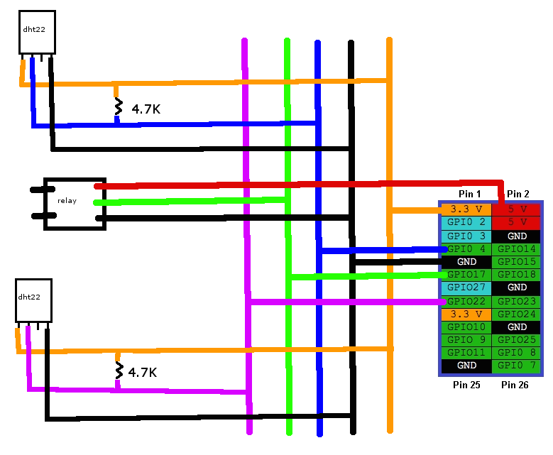

# Ταυτότητα Έργου

## Περιγραφή

Πολλά σύγχρονα σπίτια έχουν αυτόνομη θέρμανση.
Οι θερμοστάτες που έχουν είναι απλοί και προσφέρουν μόνο την ενεργοποίηση τους κάτω από κάποια θερμοκρασία.
Επίσης, διάφορες θερμαντικές ηλεκτρικές συσκευές δεν έχουν θερμοστάτη ή αν έχουν ενεργοποιούνται κάτω από 
κάποια θερμοκρασία.
Η παρούσα πρόταση έχει ως σκοπό την δημιουργία ενός θερμοστάτη με αυξημένες δυνατότητες.
Η συγκεκριμένη υλοποίηση αποτελεί μια οικονομική λύση αλλά και μια λύση φιλική ως προς το περιβάλλον.
Παρέχει πολλαπλές δυνατότητες έλεγχου (ενεργοποίησης-λειτουργίας-απενεργοποίησης) 
του συστήματος θέρμανσης πολλές περισσότερες σε σχέση με τους συμβατικούς θερμοστάτες ενώ η τιμή 
αγοράς τους δεν ξεπερνάει την τιμή αγοράς ενός συμβατικού θερμοστάτη γνωστής μάρκας. 
Οπότε αποτελεί αποτελεσματική λύση για βέλτιστο περιορισμό της αλόγιστης χρήσης του συστήματος 
θέρμανσης  και εξοικονόμηση ενέργειας.

## Χρήση και Χρήστες του Έργου

Το σύστημα απευθύνεται σε:

* ιδιοκτήτες σπιτιών με αυτόνομη θέρμανση.
* ιδιοκτήτες ηλεκτρικών συσκευών θέρμανσης.
* καταστήματα.
* δημόσια κτίρια, σχολεία, δημόσιες υπηρεσίες κλπ.

Ο θερμοστάτης θα έχει τις εξής δυνατότητες:

* Ο θερμοστάτης θα ενεργοποιείται αν πέσει κάτω από κάποια θερμοκρασία και θα μένει ενεργοποιημένος μέχρι να φτάσει κάποια θερμοκρασία. Για παράδειγμα, έστω ότι ο θερμοστάτης έχει χαμηλή θερμοκρασία 20 βαθμούς και μέγιστη 25 βαθμούς. Αν η θερμοκρασία του χώρου είναι 22 βαθμούς, δεν θα ενεργοποιηθεί. Αν είναι 19 βαθμούς θα ενεργοποιηθεί και θα παραμείνει ενεργοποιημένος μέχρι να φτάσει τους 25 βαθμούς.
* Η μέγιστη και ελάχιστη θερμοκρασία του θερμοστάτη θα μπορεί να ρυθμιστεί και να είναι διαφορετική ανά ώρα ή μέρα (ή κάποια άλλη υποδιαίρεση του χρόνου που επιθυμεί ο χρήστης).
* Ο θερμοστάτης θα μετρά πόσες ώρες έμεινε ενεργοποιημένος (οπότε ο χρήστης θα μπορεί να δει πόσο πετρέλαιο ή ρεύμα έκαψε).
* Ο θερμοστάτης θα μπορεί να παράγει γράφημα με την ενεργοποίηση του θερμοστάτη και την θερμοκρασία του χώρου.
* Ο θερμοστάτης θα μπορεί να έχει παραπάνω από έναν αισθητήρες θερμοκρασίας, οπότε να ενεργοποιείται αν κάποιο είναι κάτω από κάποια όρια ή να μην ενεργοποιείται αν κάποιος είναι πάνω από κάποιο όριο. Για παράδειγμα, αν έχουμε έναν εσωτερικό και έναν εξωτερικό και η θερμοκρασία που μετρά ο εξωτερικός είναι πάνω από την θερμοκρασία που μετρά ο εσωτερικός, να μην ενεργοποιείται ο θερμοστάτης γιατί αναμένεται να ανέβει η θερμοκρασία και στον εσωτερικό (θα μεταφερθεί θερμότητα από έξω στον εσωτερικό χώρο).
* Θα μπορεί να υπάρχει ένα άνω όριο στο σύνολο των ωρών χρήσς του θερμοστάτη ανά μέρα (ή κάποια άλλη χρονική υποδιαίρεση). Αν το σύνολο ωρών που είναι ενεργοποιημένος ο θερμοστάτης ξεπεράσει το όριο, τότε δεν ενεργοποιείται παραπάνω. Με αυτόν τον τρόπο ο χρήστης μπορεί να θέσει ένα άνω όριο στο κόστος θέρμανσης.
* Οι ρυθμίσεις θα γίνονται μέσω web interface. Ο θερμοστάτης θα έχει και μία κεραία η οποία θα δημιουργεί ένα ασύρματο τοπικό δίκτυο και στο οποίο θα μπορεί να συνδεθεί ο χρήστης με το τηλέφωνό του.

## Ελάχιστες Απαιτήσεις

Το υλικό που απαιτείται είναι:

* 1 * Raspberry pi
* 2 * [αισθητήρες DHT22](https://www.adafruit.com/products/385)
* 1 * [ρελέ](https://www.sparkfun.com/products/11042)
* 2 * 4.7K αντιστάσεις
* 1 * usb wifi
* καλώδια

Το λογισμικό βασίζεται σε:
* Rasbian
* Python
* Apache
* Mysql
* Php

Όλα τα παραπάνω πακέτα λογισμικού υπάρχουν στην έκδωση [Rasbian](https://www.raspbian.org).

## Αποθετήριο
Το έργο βρίσκεται στο ακόλουθο [URL](https://github.com/ellak-monades-aristeias/thermostatPI).
