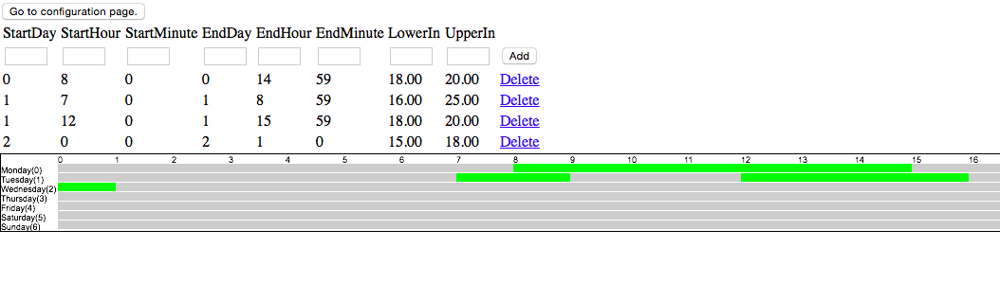

# thermostatPI
## open-source smart thermostat for a house or building. Tags: raspberry pi, thermostat, temperature, power consumption

### Περιγραφή

Η παρούσα πρόταση έχει ως σκοπό την δημιουργία ενός θερμοστάτη με αυξημένες δυνατότητες.
Η συγκεκριμένη υλοποίηση αποτελεί μια οικονομική λύση αλλά και μια λύση φιλική ως προς το περιβάλλον.
Παρέχει πολλαπλές δυνατότητες έλεγχου (ενεργοποίησης-λειτουργίας-απενεργοποίησης) 
του συστήματος θέρμανσης πολλές περισσότερες σε σχέση με τους συμβατικούς θερμοστάτες ενώ η τιμή 
αγοράς τους δεν ξεπερνάει την τιμή αγοράς ενός συμβατικού θερμοστάτη γνωστής μάρκας. 
Οπότε αποτελεί αποτελεσματική λύση για βέλτιστο περιορισμό της αλόγιστης χρήσης του συστήματος 
θέρμανσης  και εξοικονόμηση ενέργειας.

### Χρήστες

Το σύστημα απευθύνεται σε:

* ιδιοκτήτες σπιτιών με αυτόνομη θέρμανση.
* ιδιοκτήτες ηλεκτρικών συσκευών θέρμανσης.
* καταστήματα.
* δημόσια κτίρια, σχολεία, δημόσιες υπηρεσίες κλπ.

Ο θερμοστάτης μπορεί να ρυθμιστεί ανά ώρα της εβδομάδας σε διαφορετική θερμοκρασία, καθώς και να μετρά πόσες ώρες ενεργοποιήθηκε.

### Ελάχιστες Απαιτήσεις

Το υλικό που απαιτείται είναι:

* 1 * Raspberry pi
* 2 * [αισθητήρες DHT22](https://www.adafruit.com/products/385)
* 1 * [ρελέ](https://www.sparkfun.com/products/11042)
* 2 * 4.7K αντιστάσεις
* 1 * usb wifi
* καλώδια

Το λογισμικό βασίζεται σε:
* Rasbian
* Python
* Apache
* Mysql
* Php

Όλα τα παραπάνω πακέτα λογισμικού υπάρχουν στην έκδωση [Rasbian](https://www.raspbian.org).

## Αποθετήριο
Το έργο βρίσκεται στο ακόλουθο [URL](https://github.com/ellak-monades-aristeias/thermostatPI).
